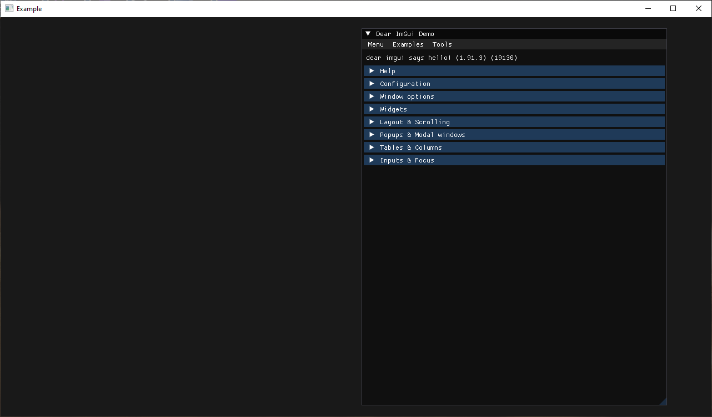

# imgui-go

A binding for imgui in Go.

## Example

Try the example with `go run github.com/nitrix/imgui-go/example@latest`.

The sources for it are located here [example/example.go](example/example.go).

## Progress

The bindings are still very limited. The generator needs to be re-written to handle many conversion edge cases.

## Important

You're currently limited to using the OpenGL and GLFW backends. The GLFW window must be created by [this other library](https://github.com/nitrix/glfw-go)
because the backends rely on recently added enums that not all the other popular bindings support.

## License

This is free and unencumbered software released into the public domain. See the [UNLICENSE](UNLICENSE) file for more details.
