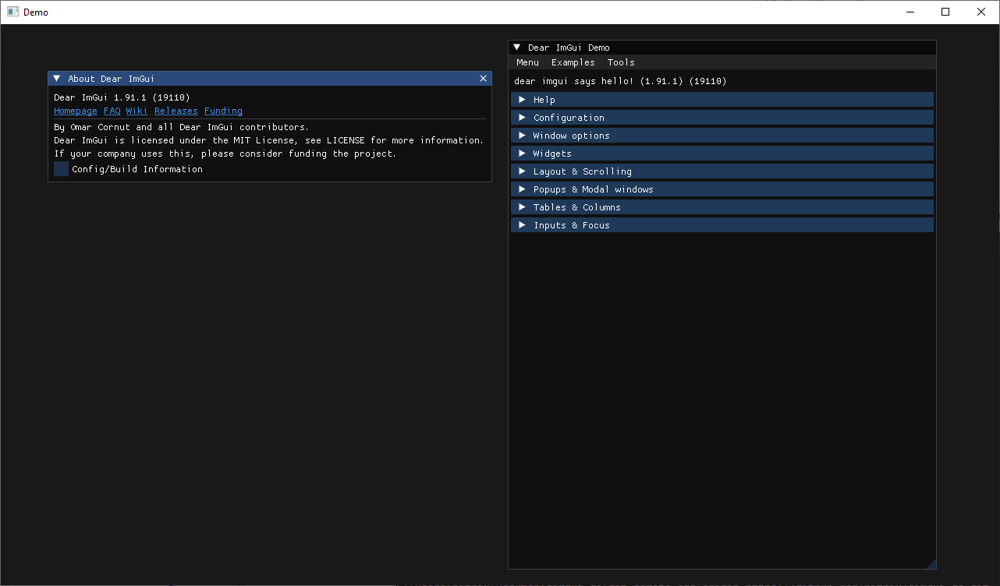

# imgui-go

A binding for imgui in Go.

## Example



Try the example with `go run github.com/nitrix/imgui-go/example@latest`.

The sources for it are located here [example/example.go](example/example.go).

## Status

Still very much a proof-of-concept. It's missing the GitHub actions + binaries for linux and mac.

## Important

You're limited to using OpenGL and GLFW. The glfw bindings have to the ones provided in this repo as popular alternatives (like `github.com/go-gl/glfw`) aren't recent enough for the imgui backends to work and will panic at runtime on unknown enums.

## Maintainers

The binaries inside of `dist` are compiled using CMake with:

```
mkdir build
cd build
cmake ..
ninja
cd ..
```

Then moved to their appropriate location with:

```
go run ./generate
```

The process has to be repeated on every supported platform.

## License

This is free and unencumbered software released into the public domain. See the [UNLICENSE](UNLICENSE) file for more details.